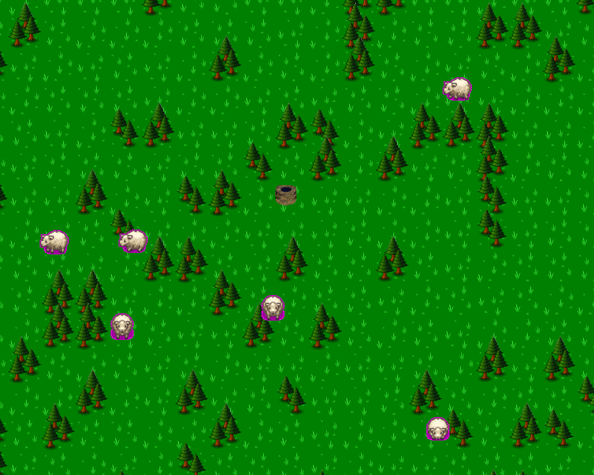

# Sheep Meadow — 2D Graphics Engine Demo

A real-time 2D graphics application built from scratch in C using OpenGL (via GLFW/GLAD). Features procedural lightning generation, particle systems, sprite animation, tile-based world rendering, and interactive gameplay mechanics.

**Built as a university project for the 2D Computer Graphics course at RAF Belgrade.**




## Features

- **Tile-based world** — 128x128 procedurally generated meadow with camera scrolling
- **Sprite animation** — Animated sheep with multiple states (idle, moving, shaved) and directional sprites
- **Particle system** — Up to 500 particles with elasticity-based physics, triggered on sheep shearing
- **Procedural lightning** — Generated using L-systems with recursive subdivision and Gaussian blur for glow
- **Storm system** — Multi-phase weather effect with expanding cloud circles, screen darkening, and thunder flicker
- **AI sheep behavior** — State machine driven (idle/move) with random wandering patterns
- **Interactive gameplay** — Drag sheep, spawn new ones from a well, shear them with right-click

## Controls

| Key | Action |
|-----|--------|
| `WASD` | Move main sheep |
| `RMB` (hover) | Shear a sheep |
| `LMB` on well | Spawn a new sheep |
| `LMB` (hold) | Drag main sheep |
| `Q` | Quick-spawn sheep (no cooldown) |
| `T` (hold) | Activate orb attack — draws lightning to negative sheep |

## Technical Highlights

- Custom single-header framework (`rafgl.h`) wrapping OpenGL for 2D raster operations
- L-system based lightning bolt generation ([based on this paper](https://www.cs.rpi.edu/~cutler/classes/advancedgraphics/S09/final_projects/lapointe_stiert.pdf))
- Negative color filter for "cursed" sheep with 20% spawn probability
- Gaussian blur post-processing for lightning glow effect
- Trigonometric orbital animation for attack orbs

## Building & Running

### Prerequisites

- GCC
- GLFW 3 library

### Linux / macOS

```bash
# Install GLFW
sudo apt-get install libglfw3-dev   # Debian/Ubuntu
brew install glfw                    # macOS

# Build and run
cd sheep/
make
```

### Windows (Code::Blocks)

Open `sheep/RAFGL.cbp` in Code::Blocks and build the project. The GLFW libraries are included in `sheep/libs/`.

## Project Structure

```
sheep/
├── main.c              # Entry point, engine initialization
├── src/
│   └── main_state.c   # All game logic (sheep AI, storms, particles, rendering)
├── include/
│   ├── rafgl.h         # RAFGL framework (single-header 2D graphics library)
│   ├── main_state.h    # Game state interface
│   └── game_constants.h
├── res/                # Sprites, tiles, and fonts
├── libs/               # Pre-built GLFW for Windows
└── Makefile            # Linux/macOS build
```

## License

This project was created for educational purposes.
